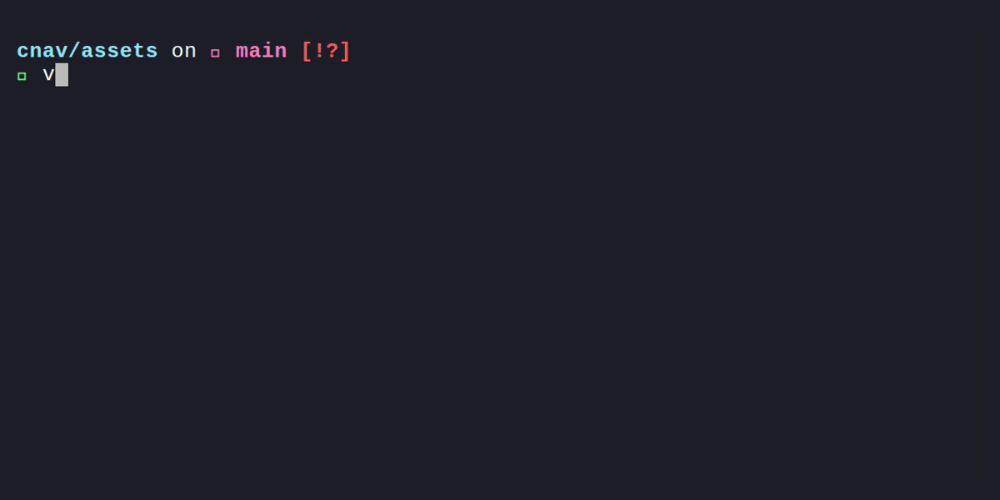

# 🧭 CNav (Command Navigation)

<p align="center">
  
  
  
  
  
</p>

<p align="center">
  
</p>

**CNav** is a lightweight, blazingly fast CLI tool written in C11 that transparently tracks your file usage habits directly from the terminal and lets you reopen them instantly using fuzzy searching.

By seamlessly integrating with your shell (Bash or PowerShell), CNav remembers which files you open, which programs you use to open them, and how often you do it. It builds a robust **frecency-based** (frequency + recency) SQLite database to act as your smart file navigator.

---

## ✨ Features

* **Cross-Platform:** Fully supports Linux, macOS (Bash), and Windows (PowerShell).
* **Robust SQLite Backend:** Safely stores history in a local SQLite database (`cnav.db`). Built using the SQLite Amalgamation approach, so there are **no external dependencies** to install.
* **Smart Fuzzy Search:** Uses a custom prefix-aware **Levenshtein distance** algorithm. It tolerates typos and forgives incomplete search terms. 
* **Context-Aware Scoring:** Files located in your Current Working Directory (CWD) receive a score boost, ensuring highly relevant search results.
* **Transparent Tracking:** Operates silently in the background via intelligent shell hooks. It does not block your terminal, pollute your `stdout`, or break pipelines (e.g., `cat file.txt | grep X` works perfectly).
* **Success-Aware:** CNav only tracks commands that execute successfully. Typos won't pollute your database.

---

## 🛠️ How it Works (The Algorithm)

When you search for a file using `n <search_term>`, CNav ranks all files in your database based on a custom algorithm:
1. **Frecency:** Calculates a base score using the total number of calls (`callNo`) divided by the time elapsed since the last call (`deltaTime`).
2. **Levenshtein Penalty:** Applies a penalty based on typo count. It intelligently subtracts missing trailing characters, so partial inputs (e.g., typing `to` for `tools.txt`) are not heavily penalized.
3. **CWD Boost:** If the matched file resides in the directory you are currently in, its final score is multiplied by 2.

CNav then automatically opens the highest-scoring file with the exact program you originally used!

---

## 📦 Build Instructions

CNav is built with CMake to ensure seamless compilation across different operating systems and compilers (GCC, Clang, MSVC).

### Prerequisites
* CMake (>= 3.10)
* A C Compiler (GCC/Clang for Linux/macOS, MSVC for Windows)

### 1. Clone the repository
```bash
git clone https://github.com/Raiza04/cnav.git
cd cnav
```

### 2. Compile

**On Linux / macOS:**
```bash
./build.sh
```

**On Windows (PowerShell):**
```powershell
.\build.ps1
```
*(Alternatively, you can manually run `cmake -B build` followed by `cmake --build build --parallel` on any OS).*

---

## ⚙️ Setup & Configuration

To allow CNav to intercept your commands, you need to update your shell configuration and tell CNav which tools it should track.

### 1. Define Tools to Track
CNav creates a configuration directory in your local app data folder (e.g., `~/.local/share/cnav/` on Linux). Edit the `tools.txt` file in this directory to include the commands you want to track (one per line):
```text
# Example tools.txt
vim
nano
cat
batcat
code
```

### 2. Initialize Shell Hooks

**🐧 For Linux / macOS (Bash):**
Add the following lines to your `~/.bashrc`.
> ⚠️ **CRITICAL ORDER:** The CNav initialization **MUST** happen before you define or source any aliases (like `~/.bash_aliases`).

```bash
# 1. Add CNav build directory to your PATH (Adjust the path!)
export PATH="$PATH:/path/to/your/cnav/build"

# 2. Initialize CNav hooks FIRST
eval "$(n --init)"

# 3. Load your aliases AFTER CNav
if [ -f ~/.bash_aliases ]; then
    . ~/.bash_aliases
fi
```
Run `source ~/.bashrc` to apply the changes.

**🪟 For Windows (PowerShell):**
Add the following to your PowerShell Profile (You can open it by typing `notepad $PROFILE` in PowerShell):

```powershell
# Add CNav to PATH (Adjust the path!)
$env:PATH += ";C:\path\to\your\cnav\build"

# Initialize CNav
Invoke-Expression "$(n --init)"
```
Restart your PowerShell or run `. $PROFILE` to apply.

---

## 🚀 Usage

Using CNav is incredibly simple because tracking happens completely in the background.

### 1. Tracking Files (Automatic)
Just use your terminal normally:
```bash
vim src/main.c
batcat README.md
```
If the command succeeds, CNav silently logs the file and the program used, updates the SQLite database, and increments the usage counter.

### 2. Opening Tracked Files
To quickly open a file, call `n` followed by a search term. CNav will find the best match and open it.
```bash
n main        # Might open src/main.c in vim
n read        # Might open README.md in batcat
n tb          # Might open tools.txt (Typo tolerance!)
```

### 3. Database Management
CNav provides built-in flags to manage your tracked history:

```bash
# View a formatted table of your tracked files, sorted by recent usage
n --list

# Clean the database (removes entries of files that no longer exist on disk)
n --clean

# Resets the database (removes every single entry from database)
n --purge

# Removes one single entry of choice from the database(the name can be incomplete)
n -d tes    #this might remove test.txt from the db
```

---

## 📄 License

This project is open-source and available under the **MIT License**.
