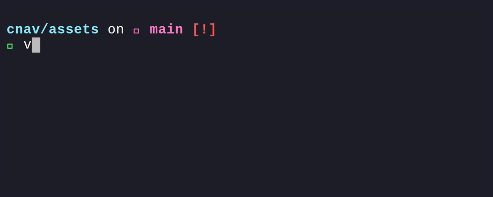

# 🧭 CNav (Command Navigation)

<p align="center">
  
  
  
  
  
</p>

<p align="center">
  
</p>

**CNav** is a lightweight, blazingly fast CLI tool written in C11 that transparently tracks your file usage habits directly from the terminal, accelerates your workflow, and lets you reopen files instantly using fuzzy searching.

By seamlessly integrating with your shell (Bash, Zsh, or PowerShell), CNav remembers which files you open, which programs you use to open them, and how often you do it. It builds a robust **frecency-based** (frequency + recency) SQLite database to act as your smart file navigator.

---

## ✨ Features

* **Cross-Platform:** Fully supports Linux, macOS (Bash/Zsh), and Windows (PowerShell).
* **Robust SQLite Backend:** Safely stores history in a local SQLite database (`cnav.db`). Built using the SQLite Amalgamation approach, so there are **no external dependencies** to install.
* **Smart Fuzzy Search:** Uses a custom prefix-aware **Levenshtein distance** algorithm. It tolerates typos and forgives incomplete search terms. 
* **Context-Aware Scoring:** Files located in your Current Working Directory (CWD) receive a score boost, ensuring highly relevant search results.
* **Transparent Tracking:** Operates silently in the background via intelligent shell hooks. It does not block your terminal, pollute your `stdout`, or break pipelines.
* **Success-Aware:** CNav only tracks commands that execute successfully. Typos won't pollute your database.
* **Smart Auto-completion:** CNav natively integrates with your shell to provide dynamic, real-time tab completion for the files stored in your database!

---

## 📦 Installation

  <details>
  <summary><strong>Linux & macOS</strong></summary>

  >#### Easy way (Pre-compiled Binaries)
  > 
  > The easiest way is to install the binary files. To do this copy-paste this line into your shell (bash/zsh).
  >   ```bash
  >   curl -sSfL https://raw.githubusercontent.com/Raiza04/cnav/main/install.sh | bash
  >   ```
  > 
  >#### Manual installation
  > Follow the steps below if you wish to install it manually.
  > 
  > ##### Prerequisites
  >   - CMake (>= 3.10)
  >   - A C Compiler (GCC/Clang)
  > 
  > ##### Clone & Compile
  > 
  > ```bash
  > git clone https://github.com/Raiza04/cnav.git
  > cd cnav
  > ./build.sh
  > ```
  > 
  > ##### Shell Setup
  > 
  > You must add CNav to your PATH and initialize the hooks.<br>
  > Add these lines at the end of your shell profile **(`~/.bashrc` or `~/.zshrc`):**
  > 
  > ```bash
  > export PATH="$PATH:/path/to/cnav/build"
  > eval "$(n --init)"
  > ```
  >
  > You have to restart the terminal or source the shell profile again (e.g. `source ~/.bashrc`) no matter which method you use.

    
  </details>
  <details>
  <summary><strong>Windows</strong></summary>
  
  > #### Easy way (Pre-compiled Binaries)
  > **`NOTE`**: Please refer to linux installation if you use git bash.
  > 
  > The easiest way is to install the binary files. To do this copy-paste this line into your PowerShell (NOT CMD). 
  > 
  >  ```powershell
  >  Invoke-Expression (Invoke-WebRequest -Uri "https://raw.githubusercontent.com/Raiza04/cnav/main/install.ps1" -UseBasicParsing).Content
  > ```
  > 
  > #### Manual installation
  > If you wish to install it manually yourself then follow the steps below.
  > 
  > ##### Prerequisites
  >   - CMake (>= 3.10)
  >   - A C Compiler (MSVC)
  >   - git if not already installed for clone
  > 
  > ##### Clone & Compile
  > 
  > ```powershell
  > git clone https://github.com/Raiza04/cnav.git
  > cd cnav
  > .\build.ps1
  > ```
  > 
  > ##### Shell Setup
  > 
  > You must add CNav to your PATH and initialize the hooks.<br>
  > Add these lines at the end of your shell profile **(`$PROFILE`):**
  > 
  > ```powershell
  > $env:PATH += ";C:\path\to\cnav\build\Release"
  > Invoke-Expression (n --init | Out-String)
  > ```
  > 
  > You have to restart the terminal or source the shell profile again (e.g. `. $PROFILE`) no matter which method you use.
  > 
  </details>

---

## ⚙️ Configuration (Telling CNav what to track)

CNav needs to know which tools you want to track (e.g., `vim`, `nano`, `code`).
Edit the `tools.txt` file located in:

* **Linux/macOS:** `~/.local/share/cnav/tools.txt`
* **Windows:** `%LOCALAPPDATA%\cnav\tools.txt` (or `~\AppData\Local\cnav\tools.txt`)

Add the commands you want to track (one per line):

```text
# Default tools.txt
vim
nano
cat
code
xdg-open
open
```
> ⚠️ **WARNING**: If you have aliases for some tools please write the actual name for it in the `tools.txt`. For example if you defined `v` for `vim` then write vim in tool.txt. <br>
> You can use your aliase in your normal shell. CNav will be able to catch those since the shell executes the actual program in the background.

---

## 🚀 Usage

Using CNav is incredibly simple because tracking happens completely in the background.

### 1. Tracking Files (Automatic)

Just use your terminal normally:

```bash
vim src/main.c
code README.md

```

If the command succeeds, CNav silently logs the file and the program used, updates the SQLite database, and increments the usage counter.

### 2. Opening Tracked Files

To quickly open a file, call `n` followed by a search term. CNav will find the best match and open it.

```bash
n maan        # Might open src/main.c in vim
n read        # Might open README.md in code
n to          # Might open tools.txt (Typo tolerance!)

```

### 3. Database Management

CNav provides built-in flags to manage your tracked history:

```bash
n --list      # View a formatted table of your tracked files
n --clean     # Remove entries of files that no longer exist on disk
n --purge     # Completely empty the database history
n -d test     # Interactively prompt to delete a specific entry (e.g., test.txt)

```
---

## 📄 License

This project is open-source and available under the **MIT License**.

